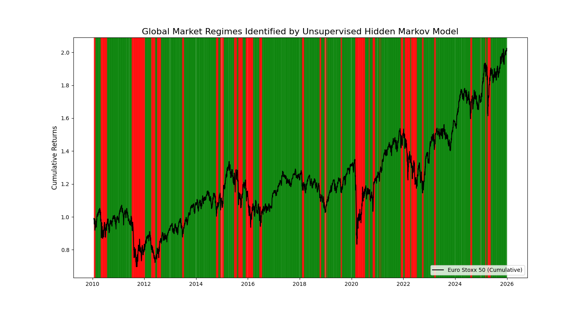

# Dynamic Asset Allocation via Macroeconomic Regime Switching
**An Empirical Application of Hidden Markov Models in Global Finance**


## 📌 Abstract
Traditional portfolio allocation models often rely on static parameters that fail to adapt to structural economic shifts. This repository presents a quantitative framework utilizing unsupervised machine learning—specifically a **Gaussian Hidden Markov Model (HMM)**—to mathematically identify latent macroeconomic regimes (expansion vs. contraction) in real-time. 

By engineering smoothed macroeconomic features (rolling volatility and systemic fear trends), the model successfully partitions the last 15 years of financial history into distinct economic states without any prior historical labeling, providing a robust foundation for dynamic risk hedging.

## 📂 Repository Architecture
```text
macro_regime_hmm_research/
│
├── data/                  # Contains raw CSV outputs and generated regime plots
├── notebooks/             # Jupyter Notebooks containing the full academic paper & interactive charts
│   └── macro_regime_analysis.ipynb
├── src/                   # Core Python execution scripts
│   ├── data_pipeline.py   # Automated data ingestion and cleaning via Yahoo Finance API
│   └── hmm_model.py       # The Gaussian HMM architecture and feature engineering logic
└── README.md              # Project documentation

## 🧠 Methodology: The Gaussian Hidden Markov Model
Financial time series are notoriously non-stationary. Instead of relying on static rolling averages, this project deploys a 2-State Gaussian HMM to infer latent market regimes from observable variance.

* **Features Engineered:** 14-day rolling volatility (Euro Stoxx 50) and systemic fear trends (VIX).
* **Objective:** Mathematically partition the timeline into **Regime 0 (Contraction/High Volatility)** and **Regime 1 (Expansion/Low Volatility)** using an entirely unsupervised, data-driven approach.

## 📊 Key Empirical Findings
The unsupervised model successfully mapped historical macroeconomic cycles without any prior labeling or historical bias. It autonomously identified major systemic shocks, including the European Sovereign Debt Crisis (2011), the Pandemic Crash (2020), and the Global Inflation Shock (2022).


*(Note: Green denotes expansionary regimes; Red denotes high-volatility contraction regimes).*

## 🚀 Quick Start & Reproducibility

To replicate these quantitative findings on your local machine:

**1. Install required dependencies:**
Ensure you have Python 3.12+ installed, then run:
`pip install pandas yfinance hmmlearn scikit-learn matplotlib`

**2. Execute the Data Pipeline:**
This script connects to the Yahoo Finance API, downloads the last 15 years of market data, and cleans it.
`python src/data_pipeline.py`

**3. Train the AI and Generate Visualizations:**
This script engineers the macro features, trains the Hidden Markov Model, and outputs the regime classification chart.
`python src/hmm_model.py`

## 🔭 Future Research Directions
* Integrating the HMM's transition probability matrix directly into a dynamic Markowitz Mean-Variance optimization framework to backtest a live trading strategy.
* Expanding the feature space to include localized labor market indicators, wage growth metrics, and yield curve inversions to capture a broader scope of the real economy.